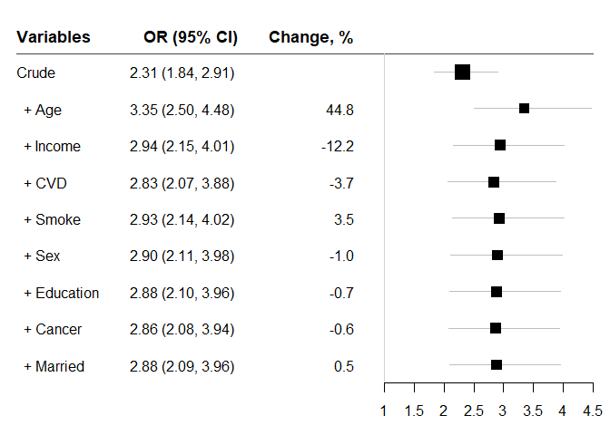
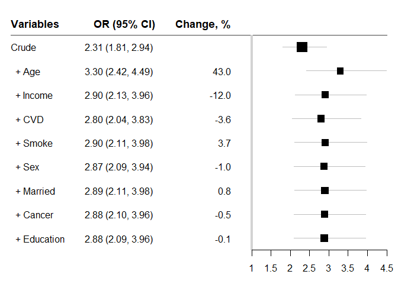
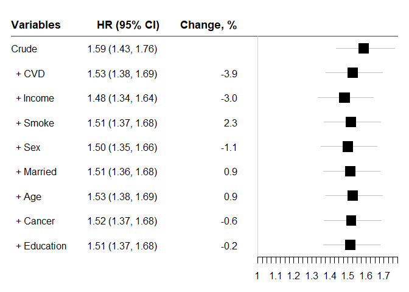
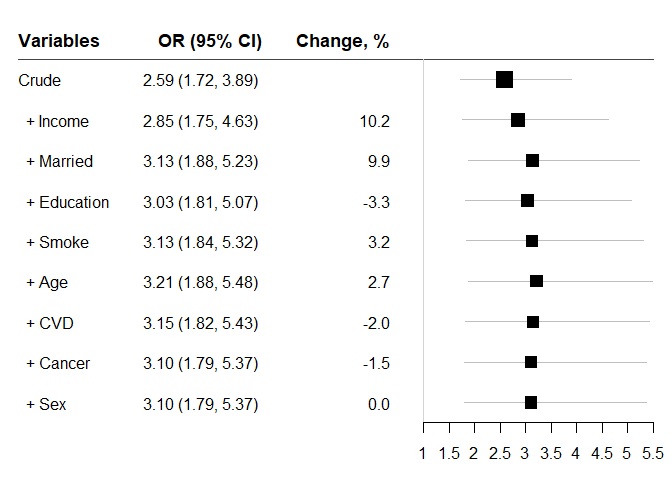

Change-in-Estimate (chest) Approach to Assess Confounding Effects
================

<!-- README.md is generated from README.Rmd. Please edit that file -->

# chest package

<!-- badges: start -->

<!-- badges: end -->

The ‘chest’ package can be used to assess confounding effects by
comparing effect estimates from many models. It calculates the changes
in effect estimates by adding one of many variables (potential
confounding factors) to the model sequentially in a stepwise fashion.
Effect estimates can be regression coefficients, odds ratios and hazard
ratios depending on the modelling methods. At each step, only one
variable that causes the largest change in the effect estimates among
the remaining variables is added to the model. Effect estimates and
change (%) values are presented in a graph and data frame table. This
approach can be used for assessing confounding effects in
epidemiological studies and bio-medical research including clinical
trials.

## Installation

You can install the released version of chest from
[CRAN](https://CRAN.R-project.org) with:

``` r
install.packages("chest")
```

## Examples

### Data: diabetes and mortality

A data frame ‘diab\_df’ is used to examine the association between
diabetes \(_Diabetes_\) and mortality \(_Endpoint_\). The purpose of
using this data set is to demonstrate the use of the functions in this
package rather than answering any research questions. Assuming it is a
cohort design for Cox Proportional Hazards Models, cross-sectional
design for Logistic Regression Model and matched cohort design for
Conditional logistic regression Models.

### chest\_speedglm: report odds ratios at all steps with logistic regression models

``` r
library(chest)
chest_speedglm(
  crude = "Endpoint ~ Diabetes",
  xlist = c("Age", "Sex", "Married", "Smoke", "Cancer", "CVD","Education", "Income"), 
  zero = 1, data = diab_df)
```



    #>       variables       OR       lb       ub      Change        p    n
    #> 1         Crude 2.312758 1.838975 2.908604          NA 7.57e-13 2372
    #> 2         + Age 3.348051 2.500654 4.482605  44.7644279 4.83e-16 2372
    #> 3      + Income 2.940581 2.153766 4.014836 -12.1703550 1.13e-11 2061
    #> 4         + CVD 2.831739 2.068823 3.875994  -3.7013899 8.09e-11 2061
    #> 5       + Smoke 2.930687 2.135170 4.022595   3.4942324 2.84e-11 2061
    #> 6         + Sex 2.901284 2.113594 3.982528  -1.0032733 4.38e-11 2061
    #> 7   + Education 2.881540 2.096819 3.959939  -0.6805040 6.81e-11 2051
    #> 8      + Cancer 2.863889 2.083367 3.936828  -0.6125761 9.11e-11 2051
    #> 9     + Married 2.878757 2.093150 3.959219   0.5191530 7.88e-11 2048

Odds ratios showing the association between *Diabetes* and mortality
*Endpoint* after each of other factors added to the model.

### When the list of variables is long, generate a variable list first:

``` r
vlist <- c("Age", "Sex", "Married", "Smoke", "Cancer", "CVD","Education", "Income")
chest_speedglm(
  crude = "Endpoint ~ Diabetes",
  xlist = vlist,   zero = 1, data = diab_df)
```


    #>       variables       OR       lb       ub      Change        p    n
    #> 1         Crude 2.312758 1.838975 2.908604          NA 7.57e-13 2372
    #> 2         + Age 3.348051 2.500654 4.482605  44.7644279 4.83e-16 2372
    #> 3      + Income 2.940581 2.153766 4.014836 -12.1703550 1.13e-11 2061
    #> 4         + CVD 2.831739 2.068823 3.875994  -3.7013899 8.09e-11 2061
    #> 5       + Smoke 2.930687 2.135170 4.022595   3.4942324 2.84e-11 2061
    #> 6         + Sex 2.901284 2.113594 3.982528  -1.0032733 4.38e-11 2061
    #> 7   + Education 2.881540 2.096819 3.959939  -0.6805040 6.81e-11 2051
    #> 8      + Cancer 2.863889 2.083367 3.936828  -0.6125761 9.11e-11 2051
    #> 9     + Married 2.878757 2.093150 3.959219   0.5191530 7.88e-11 2048

### Remove missing values, and change non-effect line

``` r
chest_speedglm(
  crude = "Endpoint ~ Diabetes", xlist = vlist, 
  data = diab_df, zero = c(0.98, 1.02),  na_omit = TRUE)
```



    #>       variables       OR       lb       ub       Change        p    n
    #> 1         Crude 2.305786 1.809862 2.937600           NA 1.37e-11 2048
    #> 2         + Age 3.297099 2.421755 4.488837  42.99238627 3.50e-14 2048
    #> 3      + Income 2.902046 2.125534 3.962238 -11.98183743 2.00e-11 2048
    #> 4         + CVD 2.797882 2.044220 3.829405  -3.58931015 1.32e-10 2048
    #> 5       + Smoke 2.900600 2.113218 3.981361   3.67127605 4.39e-11 2048
    #> 6         + Sex 2.872333 2.092484 3.942824  -0.97453037 6.65e-11 2048
    #> 7     + Married 2.894543 2.107594 3.975330   0.77324421 5.19e-11 2048
    #> 8      + Cancer 2.881019 2.097209 3.957769  -0.46723505 6.52e-11 2048
    #> 9   + Education 2.878757 2.093150 3.959219  -0.07851916 7.88e-11 2048

### chest\_glm: Logistic regression using (generalized linear models, ‘glm’).

‘chest\_glm’ is slower than ‘chest\_speedglm’. We can use ‘indicate =
TRUE’ to monitor the progress. If it is too slow, you may want to try
‘chest\_speedglm’.

``` r
 chest_glm(crude = "Endpoint ~ Diabetes", xlist = vlist, data = diab_df, indicate = TRUE)
```

### chest\_cox: Using Cox Proportional Hazards Models: ‘coxph’ of ‘survival’ package

``` r

chest_cox(crude = "Surv(t0, t1, Endpoint) ~ Diabetes", xlist = vlist,
          na_omit = TRUE, data = diab_df, zero = 1)
```



    #>       variables       HR       lb       ub     Change            p    n
    #> 1         Crude 1.588134 1.434544 1.758167         NA 4.950249e-19 2048
    #> 2         + CVD 1.526276 1.377192 1.691499 -3.8949795 7.454317e-16 2048
    #> 3      + Income 1.480726 1.335380 1.641891 -2.9844079 9.581156e-14 2048
    #> 4       + Smoke 1.514956 1.366037 1.680108  2.3116907 3.596810e-15 2048
    #> 5         + Sex 1.498963 1.351879 1.662049 -1.0556582 1.571022e-14 2048
    #> 6     + Married 1.512616 1.363974 1.677456  0.9108110 4.451213e-15 2048
    #> 7         + Age 1.526426 1.376076 1.693202  0.9129952 1.305521e-15 2048
    #> 8      + Cancer 1.517896 1.368399 1.683726 -0.5587865 3.050629e-15 2048
    #> 9   + Education 1.514437 1.365204 1.679982 -0.2279234 4.453189e-15 2048

### ‘chest\_clogit’: Conditional logistic regression: ‘clogit’ of ‘survival’ package

``` r
chest_clogit(crude = "Endpoint ~ Diabetes + strata(mid)", 
             xlist = vlist, data = diab_df, indicate= TRUE, zero = 1)
#>  2 out of 9 3 out of 9 4 out of 9 5 out of 9 6 out of 9 7 out of 9 8 out of 9 9 out of 9
```



    #>       variables       OR       lb       ub    Change            p    n
    #> 1         Crude 2.586950 1.719871 3.891170        NA 5.033866e-06 2372
    #> 2      + Income 2.850010 1.752942 4.633671 10.168718 2.405822e-05 2061
    #> 3     + Married 3.133480 1.875838 5.234301  9.946296 1.283423e-05 2058
    #> 4   + Education 3.030468 1.810620 5.072149 -3.287484 2.452619e-05 2048
    #> 5       + Smoke 3.128331 1.839469 5.320260  3.229314 2.559384e-05 2048
    #> 6         + Age 3.212487 1.883223 5.480007  2.690121 1.844153e-05 2048
    #> 7         + CVD 3.148114 1.824571 5.431754 -2.003848 3.776568e-05 2048
    #> 8      + Cancer 3.100427 1.790709 5.368067 -1.514782 5.340664e-05 2048
    #> 9         + Sex 3.100427 1.790709 5.368067  0.000000 5.340664e-05 2048

## Note:

Because ‘chest’ fits many models and compares effect estimates, some
analyses may take long time to complete. In that case, consider
‘chest\_speedglm’ for logistic regression and ‘chest\_clogit’ with an
argument of approximate method for conditional logistic regression.
